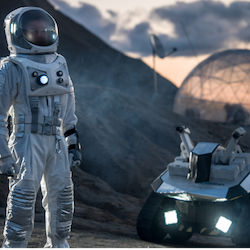
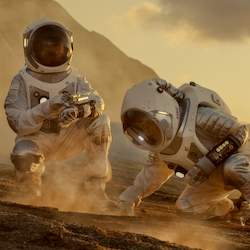
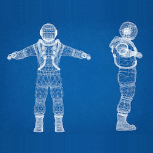

**Project DEIMOS (Distributed Environmental Information Monitoring System)**  

  

While past robotic missions to Mars have focused on landing sophisticated instruments in a single area, Project DEIMOS aims to explore the alternative strategy of deploying a number of simple instrument packages over a large area. By measuring atmospheric pressure, solar irradiance, temperature, and seismic acceleration at multiple points, DEIMOS will be able to observe the propagation of weather systems and seismic waves in real-time. Crew engineer Jin Sing Sia is developing this project.

---
**Real-time field microbial DNA sequencing**  

  

We will conduct real-time DNA-sequencing of the soil in the surrounding Utah desert using the [Oxford Nanopore MinION](https://nanoporetech.com/products/minion#). Methane has been reported in this soil and has implications about greenhouse gases on Earth. Methane has also been reported on Mars and has implications about the possibility of extraterrestrial life. In both cases, it is unknown whether the methane source is biological. Our project serves as a proof-of-concept that DNA-sequencing can be successful in remote regions without sequencing facilities. It also bridges investigation of greenhouse gases on Earth with the search for life on other planets - reflecting an overall theme that [space research has significantly informed climate change knowledge here on Earth](https://mdrs228.github.io/blog/2019/11/07/post/). Commander Lindsay Rutter designed this project and has applied to various funding sources. 

---
**Team dynamics in extreme environments**  

  

Participant observations will be conducted in order to understand social forces that underlie group interactions in space analog environments. Crew sociologist Inga Popovaite will be collecting and analyzing this data for her dissertation. She brings experience investigating [sociological and gender interaction studies at MDRS](http://mdrs.marssociety.org/research/gender-and-crew-domination-in-mdrs-simulations). 

---
**Cardiac arrest resuscitation simulations in extreme environments**  

  

We will examine two specific scenarios relating to cardiac arrest of a crew member: inside the habitat and during EVA. Both scenarios will ideally be tested multiple times to collect useful data giving the crew the opportunity to provide recommendations on extraterrestrial-specific basic and advanced (BLS and ALS) guidelines. The preliminary procedures will be derived from current guidelines for hypogravity-specific basic life support (BLS) and CPR. Investigating such scenarios will enable the assessment of the feasibility of the procedures, and provide observations for fine-tuning them. Even though MDRS does not offer a chance to evaluate CPR procedures in simulated hypogravity, it is a unique environment with a combination of factors that resemble a Martian habitat. The isolated nature of MDRS provides a unique opportunity to test and analyze emergency procedures, and most importantly examine the response of crew members and observe potential points of failure. As an instructor for the European Resuscitation Council, Health and Safety Officer Dr. Olympiou Charikleia is designing and leading this project.

---
**Creativity and stress levels in restricted environments**  

We will conduct experiments that measure creativity and stress everyday in the station. We will gather various types of physiological data including heart rate, temperature data, and amylase in saliva. These data will be provided to researchers for the analysis of what factors affect creativity and stress. We will also be investigating how plants, foods, and meditation affect crew members in the restricted environment. GreenHab Officer Yuzo Shibata is an independent advisor between artists and scientists and will be leading this project.
